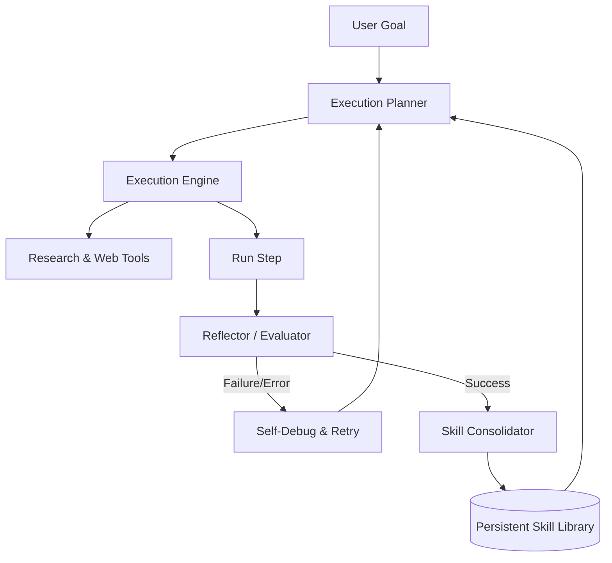

# ASTRA: Autonomous Skill Training & Reflection Agent 🚀

[](https://opensource.org/licenses/MIT)
[](https://www.python.org/)
[]()

**ASTRA** (Autonomous Skill Training & Reflection Agent) is a self-improving AI agent designed to autonomously learn new skills from goals, conduct research, reflect on execution outcomes, and maintain a persistent, reusable skill library. 

Every successfully completed task or newly acquired workflow becomes part of ASTRA's long-term memory, enabling continuous adaptation, lifelong learning, and capability growth.

---

## 🌟 Key Capabilities

- 🎓 **Autonomous Skill Acquisition**: Discovers, designs, and refines new skills based on user-defined goals.
- 📚 **Persistent Skill Library**: Saves verified capabilities as reusable Python components or schemas.
- 🔍 **Reflective Learning**: Performs post-execution evaluation and self-reflection to debug and optimize strategies.
- 🌐 **Autonomous Research**: Harnesses web research and external tool execution to gather domain-specific knowledge.
- 🧠 **Multi-tiered Memory**: Integrates short-term buffer, semantic memory (vector-based), and persistent skill stores.

---

## 🏗️ Architecture Overview

The system operates in a continuous loop of goal analysis, execution planning, reflection, and consolidation:



1. **Planner**: Decides how to solve the goal using existing skills.
2. **Research Engine**: Synthesizes online info to augment knowledge.
3. **Execution & Reflection**: Tries steps, validates outputs, and reflects on failures.
4. **Skill Library**: Compiles successful code blocks/workflows into permanent skills.

---

## 📂 Project Directory Structure

```text
astra/
│
├── __init__.py
├── agent.py         # Main agent loop and planning orchestrator
├── memory.py        # Memory management (short-term & semantic)
├── skills.py        # Skill registry, load/store mechanisms
├── reflection.py    # Evaluation and strategy reflection logic
├── research.py      # Web research and browser interaction wrappers
└── py.typed         # PEP 561 marker
```

---

## ⚙️ Installation

To install ASTRA locally for development:

```bash
git clone https://github.com/devxjitin/ASTRA.git
cd ASTRA
pip install -e .
```

---

## 🏷️ Keywords & Topics

`ai-agent` • `autonomous-agent` • `agentic-ai` • `autonomous-learning` • `self-learning` • `skill-acquisition` • `skill-library` • `knowledge-management` • `reflective-agent` • `memory-system` • `lifelong-learning` • `adaptive-agent` • `reasoning-agent` • `research-agent` • `autonomous-research` • `continuous-learning` • `ai-automation` • `knowledge-engine` • `experience-based-learning` • `intelligent-agent`
